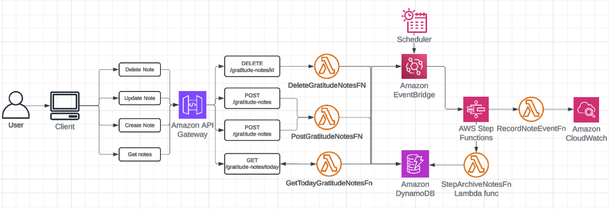
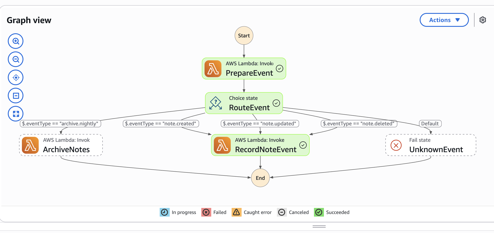
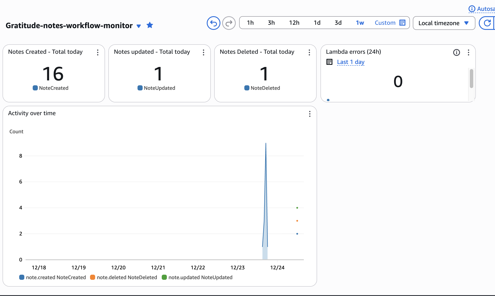

# Daily Gratitude Notes

**🚧 This is an ongoing project and still under active development.**

A full-stack serverless application for sharing daily gratitude notes with automatic archiving and event-driven observability.

## 🛠️ Tech Stack

- **Frontend:** React 18 · TypeScript · Vite · Tailwind CSS
- **Backend:** Python 3.13 · AWS Lambda · DynamoDB
- **Infrastructure:** API Gateway · EventBridge · Step Functions · CloudWatch · SES
- **Auth:** Google OAuth 2.0

## ✨ Features

- **Daily gratitude sharing** – Post one gratitude note per day, visible to everyone
- **One note per email** – Automatic upsert prevents duplicates
- **Edit & delete** – Modify your note anytime with owner token
- **Auto-archive** – Notes automatically cleared at 23:00 local time
- **Event-driven observability** – Lifecycle events tracked via CloudWatch metrics
- **Feedback system** – In-app feedback sent directly via email

## 📐 Architecture

### System Architecture



_High-level system architecture showing API Gateway, Lambda functions, DynamoDB, EventBridge, and Step Functions integration._

### Workflow Orchestration



_Step Functions state machine orchestrating archive and observability workflows._

### Monitoring & Observability



_Real-time CloudWatch dashboard tracking note lifecycle events and system health._

**Components:**

- **API Gateway** – REST endpoints (`/gratitude-notes`, `/feedback`)
- **Lambda Functions** – API handlers + Step Functions tasks
- **DynamoDB** – `gratitude_notes` table (TTL: 7 days)
- **Step Functions** – `GratitudeWorkflow` orchestrates archive and observability workflows
- **EventBridge** – Routes note lifecycle events to Step Functions
- **CloudWatch** – Custom metrics (`DailyGratitude` namespace) and monitoring dashboard
- **SES** – Sends feedback emails

## 🚀 Quickstart

### Prerequisites

- Node.js 18+
- Python 3.13
- AWS CLI (configured)
- AWS SAM CLI

### Backend

```bash
./scripts/deploy_backend.sh  # Deploys to eu-west-1, stack: daily-gratitude
```

The script outputs `GratitudeApiBaseUrl` for frontend configuration.

### Frontend

```bash
cd client
npm install
npm run dev  # http://localhost:5173
```

Create `client/.env.local`:

```bash
VITE_API_BASE_URL=https://xxxxx.execute-api.eu-west-1.amazonaws.com/prod
VITE_GOOGLE_CLIENT_ID=your-google-oauth-client-id.apps.googleusercontent.com
```

## 📡 API Reference

| Method   | Path                                      | Description                                                                                                                      |
| -------- | ----------------------------------------- | -------------------------------------------------------------------------------------------------------------------------------- |
| `POST`   | `/gratitude-notes`                        | Upsert note (body: `{name, email, gratitudeText}`). Returns 201 if created, 200 if updated. Enforces one note per day per email. |
| `GET`    | `/gratitude-notes/today`                  | List all active notes for today. Returns `{items: [{id, name, gratitude_text, created_at}]}`                                     |
| `DELETE` | `/gratitude-notes/{id}?token=OWNER_TOKEN` | Soft-delete note (sets `status=deleted`). Requires owner token from POST response.                                               |
| `POST`   | `/feedback`                               | Send feedback email to developer (body: `{feedback}`). Requires SES sandbox verification.                                        |

**Examples:**

```bash
# Create/update note
curl -X POST "$API_BASE_URL/gratitude-notes" \
  -H "Content-Type: application/json" \
  -d '{"name":"Alex","email":"alex@example.com","gratitudeText":"Morning coffee\nSupportive team"}'

# List today's notes
curl "$API_BASE_URL/gratitude-notes/today"

# Delete note
curl -X DELETE "$API_BASE_URL/gratitude-notes/{id}?token={owner_token}"
```

## 🔄 Event-Driven Architecture

**Archive:** EventBridge Scheduler triggers Step Functions at 23:00 local time → marks all notes as `deleted`

**Observability:** API handlers emit lifecycle events (`note.created`, `note.updated`, `note.deleted`) → Step Functions → CloudWatch metrics (`DailyGratitude` namespace)
## 📊 Observability

**Dashboard** (`Gratitude-notes-workflow-monitor`):

- Total today summary (created/updated/deleted counts)
- Activity over time (time-series graph)
- Lambda errors (24h)

## 🧪 Testing

```bash
python -m pytest server/tests/test_gratitude_notes.py
```

Tests cover: note creation/updates, listing, deletion, and archive handler. Tests are self-contained (no `conftest.py`).

## 📦 Deployment

| Script                         | Purpose                                          |
| ------------------------------ | ------------------------------------------------ |
| `./scripts/deploy_backend.sh`  | Builds & deploys SAM stack, prints API URL       |
| `./scripts/capture_outputs.sh` | Exports API base URL to `client/.env.production` |
| `./scripts/deploy_frontend.sh` | Builds SPA and uploads to S3/CloudFront          |

**Region:** `eu-west-1`  
**Stack Name:** `daily-gratitude`
