# Cloud Zone Assignment

End-to-end cloud-native solution for managing customer IDs across three missions:

1. **Mission 1** – Secure REST API (AWS SAM, Lambda, API Gateway, DynamoDB)
2. **Mission 2** – React + Vite frontend (S3 + CloudFront)
3. **Mission 3** – Event-driven workflow (EventBridge + Step Functions)


## Architecture diagram

### Architecture (end-to-end)

```mermaid
flowchart LR
  %% --- Client ---
  subgraph Client
    User
    App["React SPA client"]
  end

  %% --- Delivery (Mission 2) ---
  subgraph Delivery["Mission 2 - Delivery"]
    CF["CloudFront distribution"]
    S3["S3 static site"]
    CF --> S3
  end

  %% --- Backend (Mission 1) ---
  subgraph Backend["Mission 1 - API"]
    APIGW["API Gateway /customer-ids"]
    PutFn["Lambda Create"]
    GetFn["Lambda Read"]
    DelFn["Lambda Delete"]
    Dynamo["DynamoDB table: customer_ids"]
    APIGW --> PutFn
    APIGW --> GetFn
    APIGW --> DelFn
    PutFn --> Dynamo
    GetFn --> Dynamo
    DelFn --> Dynamo
  end

  %% --- Workflow (Mission 3) ---
  subgraph Workflow["Mission 3 - Workflow"]
    EB["EventBridge (rule: customer-id.submitted)"]
    SFN["Step Functions: customer-id-workflow"]
    Val["Lambda Validate"]
    Ins["Lambda Insert"]
    Log["Lambda Log existing"]
    EB --> SFN --> Val
    Val -- "exists: false" --> Ins --> Dynamo
    Val -- "exists: true" --> Log
    Sched["EventBridge Schedule (6h)"] -.-> EB
  end

  %% Connections between areas
  User --> App
  App -- "API key header" --> APIGW
  App -. "served by" .-> CF
  PutFn -- "PutEvents { id }" --> EB
```




## Repository layout

- `server/` – backend SAM project (`infra/template.yaml`, Lambda sources, tests)
- `client/` – React/Vite single-page app with Tailwind styling
- `scripts/` – deployment helpers (`deploy_backend.sh`, `deploy_frontend.sh`, `capture_outputs.sh`, `put_test_event.sh`)
- `docs/` – placeholder for diagrams/screenshots

## Prerequisites

- Python 3.13+
- Node.js 18+ and npm
- AWS CLI configured with credentials
- AWS SAM CLI (latest stable)

## Quick start

### Backend (Missions 1 & 3)

```bash
./scripts/deploy_backend.sh
source ./scripts/capture_outputs.sh customer-id-api-dev
curl -X PUT "$ApiBaseUrl/customer-ids" \
     -H "x-api-key: $ApiKeyForTesting" \
     -H "Content-Type: application/json" \
     -d '{"id":"TEST123"}'
```

Creating an ID triggers the Mission 3 workflow automatically; see **Mission 3 – How to test** below.

Unit tests:

```bash
cd server
python3 -m unittest discover -s tests
```

### Frontend (Mission 2)

```bash
cd client
npm install
npm run dev
```

Visit http://localhost:5173 (uses `.env.local` for API base URL and key). Production build/deploy script lives at `scripts/deploy_frontend.sh`.

### Handy scripts

- `deploy_backend.sh` – validate, build, deploy SAM stack
- `deploy_frontend.sh` – build React app, upload to S3, invalidate CloudFront
- `capture_outputs.sh` – export API base URL and key after deploy
- `put_test_event.sh` – publish a synthetic EventBridge event for Mission 3

---

## Mission 1 – Customer ID API

Serverless REST API that creates, reads, and deletes customer IDs in DynamoDB with API key protection.

### Ready-to-run curl scenarios

Export API values (after deployment) with the helper script:

```bash
source ./scripts/capture_outputs.sh customer-id-api-dev
```

- **Create new ID (201)**
  ```bash
  curl -X PUT "$ApiBaseUrl/customer-ids" \
       -H "x-api-key: $ApiKeyForTesting" \
       -H "Content-Type: application/json" \
       -d '{"id":"TEST123"}'
  ```
- **Create duplicate ID (409)**
  ```bash
  curl -X PUT "$ApiBaseUrl/customer-ids" \
       -H "x-api-key: $ApiKeyForTesting" \
       -H "Content-Type: application/json" \
       -d '{"id":"TEST123"}'
  ```
- **Create with invalid payload (400)**
  ```bash
  curl -X PUT "$ApiBaseUrl/customer-ids" \
       -H "x-api-key: $ApiKeyForTesting" \
       -H "Content-Type: application/json" \
       -d '{"id":"ab"}'
  ```
- **Fetch existing ID (200)**
  ```bash
  curl "$ApiBaseUrl/customer-ids/TEST123" \
       -H "x-api-key: $ApiKeyForTesting"
  ```
- **Fetch missing ID (404)**
  ```bash
  curl "$ApiBaseUrl/customer-ids/CUST-999" \
       -H "x-api-key: $ApiKeyForTesting"
  ```
- **Fetch with invalid path param (400)**
  ```bash
  curl "$ApiBaseUrl/customer-ids/ab" \
       -H "x-api-key: $ApiKeyForTesting"
  ```
- **Delete existing ID (200)**
  ```bash
  curl -X DELETE "$ApiBaseUrl/customer-ids/TEST123" \
       -H "x-api-key: $ApiKeyForTesting"
  ```
- **Delete missing ID (404)**
  ```bash
  curl -X DELETE "$ApiBaseUrl/customer-ids/CUST-999" \
       -H "x-api-key: $ApiKeyForTesting"
  ```
- **Delete with invalid path param (400)**
  ```bash
  curl -X DELETE "$ApiBaseUrl/customer-ids/  " \
       -H "x-api-key: $ApiKeyForTesting"
  ```

### Expected responses

| Endpoint & scenario                    | Sample request                | Expected status   | Sample response                                                        |
| -------------------------------------- | ----------------------------- | ----------------- | ---------------------------------------------------------------------- |
| `PUT /customer-ids` ✅ new ID          | Body `{"id":"TEST123"}`       | `201 Created`     | `{"message":"Customer ID stored.","id":"TEST123"}`                     |
| `PUT /customer-ids` ⚠️ duplicate       | Same body after it exists     | `409 Conflict`    | `{"message":"Customer ID already exists.","id":"TEST123"}`             |
| `PUT /customer-ids` ❌ invalid payload | Body `{}` or bad chars        | `400 Bad Request` | `{"message":"Field 'id' must be 3 to 100 characters after trimming."}` |
| `GET /customer-ids/{id}` ✅ found      | Path `/customer-ids/TEST123`  | `200 OK`          | `{"exists":true,"id":"TEST123"}`                                       |
| `GET /customer-ids/{id}` ❌ missing    | Path `/customer-ids/CUST-999` | `404 Not Found`   | `{"exists":false,"id":"CUST-999"}`                                     |
| `DELETE /customer-ids/{id}` ✅ deleted | Path `/customer-ids/TEST123`  | `200 OK`          | `{"message":"Customer ID deleted.","id":"TEST123"}`                    |
| `DELETE /customer-ids/{id}` ❌ missing | Path `/customer-ids/CUST-999` | `404 Not Found`   | `{"message":"Customer ID not found.","id":"CUST-999"}`                 |

Customer IDs must be 3–100 characters and may only contain letters, numbers, hyphen, or underscore.

---

## Mission 2 – Customer ID Frontend

Responsive single-page React app communicating with the Mission 1 API.

### Tech stack

- React 18 + TypeScript (Vite)
- Tailwind CSS with utility class composition
- Fetch API wrapper (`src/services/apiClient.ts`)
- Heroicons for status messaging

### Project layout highlights

- `src/App.tsx` – orchestrates add/check/delete forms
- `src/components/` – form cards, status banners
- `src/services/` – API client, validation helpers, response types
- `public/assets/` – screenshots used in documentation

### Run locally

```bash
cd client
npm install
npm run dev
```

Set environment variables in `client/.env.local`:

```dotenv
VITE_API_BASE_URL=https://xxxxxxxx.execute-api.eu-west-1.amazonaws.com/prod
VITE_API_KEY=test-key-123-0000000000
```

Preview build:

```bash
npm run build
npm run preview
```

Hosted build: **https://d225q5cc7dufbs.cloudfront.net/**

> Deploy script `scripts/deploy_frontend.sh` syncs the build output to the S3 bucket defined in the script (`BUCKET=customer-id-frontend`) and invalidates the CloudFront distribution (`DIST_ID=EETTBUVQTK0KF`). Update those identifiers before running it in your own AWS account.

### UI testing checklist

| Scenario                        | Expected UI                        |
| ------------------------------- | ---------------------------------- |
| Add new ID (`TEST123`)          | Green “Customer ID stored” banner  |
| Add duplicate (`TEST123` twice) | Red “Unable to store ID” banner    |
| Check existing                  | Green “ID found” banner            |
| Check missing                   | Blue “ID not found” banner         |
| Delete existing                 | Green “ID deleted” banner          |
| Delete missing                  | Red “Unable to delete ID” banner   |
| Invalid input (`ab`)            | Amber “Invalid customer ID” banner |

### Screenshots

Shows the dashboard after adding a new customer ID.


Shows adaptive UI behavior and form controls on mobile.


Shows duplicate ID error status.


---

## Mission 3 – Event-Driven Step Function Workflow

New customer IDs automatically trigger a Step Functions state machine via Amazon EventBridge.
The workflow:

1. validates the ID (format + existence),
2. **logs** if it already exists, or
3. **inserts** it into DynamoDB if it does not.

**Stack outputs**

- `CustomerWorkflowArn` – Step Function ARN
- `CustomerCreatedRuleName` – EventBridge rule name
- `CustomerWorkflowFailureAlarmName` – CloudWatch alarm name

---

### How to test

#### A) End-to-end via the API

1. Create a new ID (publishes the event automatically):
   ```bash
   curl -X PUT "$ApiBaseUrl/customer-ids" \
        -H "x-api-key: $ApiKeyForTesting" \
        -H "Content-Type: application/json" \
        -d '{"id":"STEP-DEMO-001"}'
   ```
2. Open **Step Functions → Executions** and verify a new execution appears.
3. For a new ID you should see `ValidateCustomer → InsertCustomer → End`.  
   For an existing ID you should see `ValidateCustomer → LogExistingCustomer → End`.

#### B) Direct EventBridge test (manual)

Use this **test event structure** in EventBridge (or with the CLI). It matches the rule:
`source = "mission1.customer-ids"` and `detail-type = "customer-id.submitted"`.

```json
{
  "version": "0",
  "id": "test-event-uuid",
  "detail-type": "customer-id.submitted",
  "source": "mission1.customer-ids",
  "account": "<YOUR_ACCOUNT_ID>",
  "region": "<YOUR_REGION>",
  "time": "2025-10-18T10:00:00Z",
  "resources": [],
  "detail": { "id": "STEP-DEMO-002" }
}
```

**CLI one-liner:**

```bash
aws events put-events --entries '[
  {
    "Source": "mission1.customer-ids",
    "DetailType": "customer-id.submitted",
    "Detail": "{\"id\":\"STEP-DEMO-002\"}",
    "EventBusName": "default"
  }
]'
```

**Expected result**

- Step Functions execution starts automatically.
- New ID → **InsertCustomer** path.
- Existing ID → **LogExistingCustomer** path.

---

### Scheduled scan (automatic)

An EventBridge **schedule rule** (`<stack>-scheduled-scan`) automatically triggers the Step Functions workflow every 6 hours with the input `{"id":"SCHEDULED-SCAN-001"}`.  
This serves as a periodic **health check**, verifying that the EventBridge rule and workflow integration are functioning correctly even without new API submissions.

**Verify in AWS**

- EventBridge → **Rules** → confirm `<stack>-scheduled-scan` is **ENABLED** and shows upcoming invocations.
- Step Functions → **Executions** → look for runs where the input `id` equals `SCHEDULED-SCAN-001`.
- CloudWatch Logs → `/aws/vendedlogs/states/<stack>-customer-id-workflow` → confirm a `validate_id` entry with that ID.

#### How to change the schedule rate

- Open `server/infra/template.yaml` and edit  
  `CustomerIdWorkflow.Events.ScheduledScan.Properties.Schedule`  
  (for example: `rate(3 hours)` or `cron(0 6,12,18,0 * * ? *)`).
- Redeploy with `./scripts/deploy_backend.sh`.

---

### Monitoring

- **Step function execution (Setp Functions → State machines → State machine name -> Latest execution)**

- **Metrics (CloudWatch → Metrics → AWS/States)**  
  Graph `ExecutionsStarted`, `ExecutionsSucceeded`, `ExecutionsFailed` for the state machine ARN.
- **Alarm**  
  Alarm `…customer-workflow-failures` on `ExecutionsFailed >= 1` is present (state OK is fine).
- **Logs**
  - Step Function logs: `/aws/vendedlogs/states/<stack>-customer-id-workflow`
  - Lambda logs: `/aws/lambda/CustomerId*Function`

**Structured log examples**

```json
{"action":"step_validate_customer_id","id":"STEP-DEMO-001","valid":true,"exists":false}
{"action":"step_insert_customer_id_success","id":"STEP-DEMO-001","inserted":true}
{"action":"step_log_customer_event","id":"STEP-DEMO-001","exists":true}
```

**Logs Insights query**

> Prerequisite: choose the `CustomerIdValidateFunction`, `CustomerIdInsertFunction`, and `CustomerIdLogFunction` log groups in CloudWatch Logs Insights before running the query.

```
fields @timestamp, action, id, valid, exists, @message
| filter action in ["step_validate_customer_id","step_insert_customer_id_success","step_log_customer_event"]
| sort @timestamp desc
| limit 50
```

---

## Monitoring Evidence

### Step Function execution graph

Shows workflow runs correctly for new or existing customer IDs.  
Screenshot below demonstrates successful execution of the state machine for customer ID `STEP-DEMO-001`.


### CloudWatch Metrics

Displays `ExecutionsStarted`, `ExecutionsSucceeded`, and `ExecutionsFailed` metrics for the workflow.


### CloudWatch Alarm

Shows the `customer-workflow-failures` alarm configured on `ExecutionsFailed >= 1`.


### CloudWatch Logs

Demonstrates structured log entries produced by the workflow and Lambda functions.


### EventBridge Rule

Shows the EventBridge rule that triggers the Step Functions workflow on new or scheduled events.


---

## Testing & validation summary

- Backend unit tests: `python3 -m unittest discover -s server/tests`
- Frontend type-check & build: `npm run build`
- SAM template validation: `sam validate -t server/infra/template.yaml`

## Cleanup

```bash
sam delete --stack-name customer-id-api-dev
```

For the frontend, empty or delete the S3 bucket configured in `scripts/deploy_frontend.sh` and disable/delete the associated CloudFront distribution to avoid charges.
